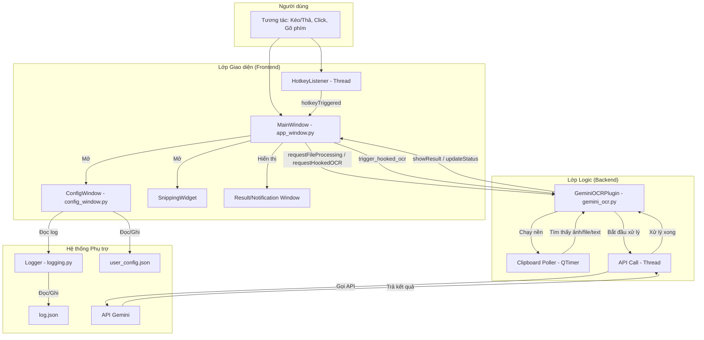

# YuukaOCR - Trợ lý OCR thông minh của Sensei


**YuukaOCR** là một ứng dụng trợ lý desktop nhỏ gọn, trong suốt và không có viền, luôn nổi trên màn hình để giúp Sensei thực hiện các tác vụ OCR (nhận dạng ký tự quang học) và xử lý văn bản/file một cách nhanh chóng với sức mạnh của API Google Gemini.

https://github.com/user-attachments/assets/e1744b82-f5cb-4752-9214-41d9a263152d

---

### ⚠️ Tuyên bố miễn trừ & Cảnh báo quan trọng

*   **Mục đích sử dụng**: Phần mềm này được tạo ra với mục đích học tập, nghiên cứu và thử nghiệm. Nó được cung cấp "nguyên trạng" (AS IS) mà không có bất kỳ sự bảo đảm nào. Tác giả không chịu trách nhiệm cho bất kỳ vấn đề nào phát sinh từ việc sử dụng, bao gồm mất dữ liệu, bất ổn hệ thống, hoặc chi phí phát sinh liên quan đến việc sử dụng API.

*   **CẢNH BÁO: KHÔNG SỬ DỤNG VỚI CÁC TRÌNH ANTI-CHEAT**
    YuukaOCR sử dụng các hook hệ thống cấp thấp (`pynput`, `win32api`) để lắng nghe phím tắt toàn cục và tương tác với các cửa sổ khác. Hành vi này có thể bị các hệ thống chống gian lận (ví dụ: Vanguard, Easy Anti-Cheat, BattlEye) nhận diện là đáng ngờ, có khả năng dẫn đến việc tài khoản game của Sensei bị **cấm (ban)**.
    **Khuyến cáo mạnh mẽ: Hãy thoát hoàn toàn YuukaOCR trước khi khởi chạy bất kỳ trò chơi nào có sử dụng phần mềm anti-cheat.**

---

## ✨ Tính năng nổi bật

*   **Giao diện Vật lý Độc đáo**: Yuuka di chuyển trên màn hình với hiệu ứng vật lý (lò xo, giảm chấn) mềm mại và vui mắt, thay vì chỉ di chuyển cứng nhắc.
*   **Window Hooking**: Tự động "hút" và bám vào cạnh trên hoặc dưới của các cửa sổ khác, giúp Yuuka luôn ở vị trí thuận tiện khi Sensei làm việc.
*   **OCR theo vùng chỉ định**: Khi đã "hook" vào một cửa sổ, Sensei có thể nhấn phím tắt để chọn một vùng và OCR liên tục tại vị trí đó, kể cả khi cửa sổ di chuyển.
*   **Xử lý đa dạng**:
    *   **Kéo và thả file**: Hỗ trợ nhiều định dạng file (ảnh, pdf, audio...).
    *   **Lắng nghe Clipboard**: Tự động xử lý ảnh, file, hoặc văn bản mà Sensei vừa copy (Ctrl+C).
    *   **Prompt tùy chỉnh**: Cho phép Sensei ra lệnh cho Yuuka xử lý dữ liệu theo ý muốn (ví dụ: dịch, tóm tắt, định dạng lại...).
*   **Tùy chỉnh sâu**:
    *   Thay đổi giao diện của Yuuka bằng file `ui.png` của riêng Sensei.
    *   Tinh chỉnh mọi thông số về màu sắc, font chữ, hiệu ứng vật lý, cơ chế hook, phím tắt...
*   **Tự động cập nhật**: Tự động kiểm tra và cập nhật lên phiên bản mới nhất từ repo Git mỗi khi khởi động.
*   **Thống kê sử dụng**: Theo dõi thời gian hoạt động và số lần gọi API của Sensei.

## 🚀 Cài đặt

Để Yuuka có thể bắt đầu làm việc, Sensei cần chuẩn bị một vài thứ sau:

### Yêu cầu
1.  **Python**: Phiên bản 3.9 trở lên.
2.  **Git**: Cần thiết cho tính năng tự động cập nhật.
3.  **Gemini API Key**: Một API Key từ [Google AI Studio](https://aistudio.google.com/app/apikey).

### Các bước cài đặt
1.  **Clone Repository**:
    ```bash
    git clone https://github.com/TEN_REPO_CUA_SENSEI/YuukaOCR.git
    cd YuukaOCR
    ```

2.  **Chạy file cài đặt**:
    Mở thư mục `YuukaOCR` vừa clone về và **click đúp chuột vào file `INSTALL.bat`**.
    Script này sẽ tự động tạo môi trường ảo và cài đặt tất cả các thư viện Python cần thiết (`PySide6`, `google-generativeai`, `pynput`, v.v.).

3.  **Thêm API Key**:
    *   Sau khi chạy `INSTALL.bat`, một thư mục `user/` sẽ được tạo.
    *   Trong thư mục `user/`, tạo một file mới tên là `.env`.
    *   Mở file `.env` và thêm vào nội dung sau, thay `YOUR_API_KEY_HERE` bằng key của Sensei:
        ```
        GOOGLE_API_KEY=YOUR_API_KEY_HERE
        ```
    *   **Cách khác**: Sensei có thể chạy ứng dụng lần đầu, Yuuka sẽ yêu cầu API key. Sensei chỉ cần copy key và Yuuka sẽ tự động xử lý.

4.  **Khởi động**:
    Click đúp chuột vào file **`RUN.bat`** để khởi động Yuuka!

## 📖 Hướng dẫn sử dụng

### Tương tác cơ bản
*   **Di chuyển**: Nhấn và giữ chuột trái vào người Yuuka để kéo đi.
*   **Mở Cài đặt**: Click chuột phải vào Yuuka hoặc click chuột trái vào nút màu cam trên áo.
*   **Đóng ứng dụng**: Click chuột trái vào nút màu hồng trên áo.
*   **Thay đổi kích thước**: Cuộn chuột khi con trỏ ở trên người Yuuka.

### Các phương thức OCR và xử lý
1.  **Kéo và Thả (Drag & Drop)**:
    Kéo một file (ảnh, pdf, ...) và thả vào người Yuuka. Yuuka sẽ bắt đầu xử lý file đó.

2.  **Clipboard**:
    *   **Ảnh**: Dùng một công cụ chụp ảnh màn hình (như `Win + Shift + S`) và copy vào clipboard. Yuuka sẽ tự động nhận diện và OCR.
    *   **File**: Copy một file trong Explorer (Ctrl+C). Yuuka sẽ xử lý file đó.
    *   **Text**: Copy một đoạn văn bản. Yuuka sẽ xử lý theo prompt tùy chỉnh của Sensei.
    *(Lưu ý: Các tính năng clipboard có thể được bật/tắt trong phần cài đặt).*

3.  **Hooking OCR (Tính năng đặc biệt)**:
    *   **Bước 1: Hook**: Kéo Yuuka đến gần cạnh trên hoặc cạnh dưới của một cửa sổ. Yuuka sẽ tự động "hút" và bám vào đó.
    *   **Bước 2: Kích hoạt**: Nhấn phím tắt OCR (mặc định là **chuột giữa**).
    *   **Bước 3: Chọn vùng**: Màn hình sẽ mờ đi. Sensei hãy kéo chuột để chọn một vùng chữ nhật trên cửa sổ đã hook.
    *   **Xong!**: Yuuka sẽ OCR vùng đó và hiển thị kết quả. Từ giờ, mỗi khi Sensei nhấn lại phím tắt, Yuuka sẽ tự động OCR lại **đúng vùng đó** mà không cần chọn lại. Vùng chọn sẽ di chuyển cùng với cửa sổ.
    *   **Thả hook**: Kéo Yuuka ra xa khỏi cửa sổ để "unhook".

## ⚙️ Tùy chỉnh

Sensei có thể tùy chỉnh gần như mọi thứ bằng cách chuột phải vào Yuuka để mở cửa sổ Cài đặt.

*   **Giao diện**:
    *   **Màu sắc & Font**: Thay đổi màu nhấn, màu nền, màu chữ, font chữ cho các cửa sổ phụ.
    *   **Tùy chỉnh UI**: Kéo một file `ui.png` của riêng Sensei vào khu vực chỉ định để thay đổi hoàn toàn ngoại hình của Yuuka.
*   **Bố cục & Vật lý**:
    *   Điều chỉnh vị trí, khoảng cách của cửa sổ kết quả/thông báo.
    *   Tinh chỉnh các thông số vật lý như độ nảy, lực cản để thay đổi cảm giác di chuyển của Yuuka.
*   **Hooking & Hotkey**:
    *   Thay đổi khoảng cách "hút" của Yuuka, vị trí neo so với cửa sổ.
    *   Đặt lại phím tắt OCR theo ý muốn (hỗ trợ cả phím chuột và bàn phím).

## 📂 Cấu trúc dự án

Dưới đây là sơ đồ cấu trúc và luồng hoạt động chính của ứng dụng:



## ❤️ Đóng góp
Mọi sự đóng góp của Sensei để giúp Yuuka thông minh và hữu ích hơn đều được chào đón! Vui lòng tạo một `Pull Request` hoặc mở một `Issue` để thảo luận về các thay đổi.

## 📄 Bản quyền
Dự án này được cấp phép theo Giấy phép MIT. Xem file `LICENSE` để biết thêm chi tiết.

---
*Cảm ơn Sensei đã sử dụng YuukaOCR! Chúc Sensei một ngày làm việc hiệu quả!*

*Readme được viết bởi Yuuka with Gemini 2.5*
